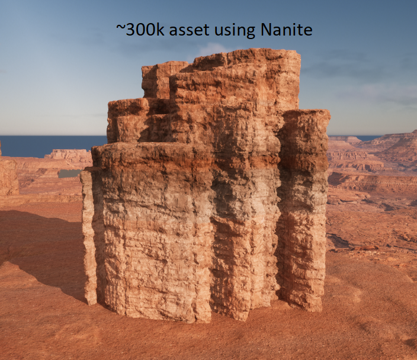

This repo contains documentation for the Procedural Rock Generator Tool in Houdini. There is no code associated due to Houdini's node network structure.

# Procedural Rock Generator 
The Procedural Rock Generator allows a user to input a base shape to create procedural rock structures. Artists can edit multiple
properties including target polygon counts, number of pieces created, and several noise settings. The tool creates both a high poly and a
low poly version of the assets. The details of the high poly asset are exported as a normal map and can be applied to the low poly asset
which has autogenerated UVs. The HDA can also be linked to a TOPS network for easy export. 

Features include:
* Create a rock model from any input base shape
* Edit rock properties including target polycount, number of pieces, piece height ramp, and more
* Edit noise settings such as frequency, amplitude, and offset to get the perfect look
* Autogenerate uv maps for low poly assets and normal maps for high poly assets
* Export options auto center pivot and rotate for easy import into Unreal Engine 5

## Asset Workflow
The basic worflow for the using the tool in Houdini to importing assets in Unreal Engine is as follows:
1. Create or import a base shape mesh into Houdini
2. Connect base mesh to the Rock Genreator HDA node
3. Edit any parameters as neccessary according to art direction
4. HDA will output 2 meshes - high poly and low poly (low poly has autogenerated UV maps)
5. Export meshes (Noncommercial Houdini only allows .obj format)
6. Export a normal map from the high poly (this can be done through Houdini Labs Maps Baker node if not noncommercial version)
7. Import low poly mesh into Unreal Engine (or both meshes if wanted)
8. Apply materials and normal maps to low poly mesh

## Unreal Engine Examples
Here are some examples of the rocks in Unreal Engine 5. All materials and ground/sky assets are from UE sample Valley of the Ancient project.

## Tool workflow
The basic workflow of how the tool works is as follows:
1. Connect input shape
2. Create silhouette of base shape and move silhouette to ground plane
3. Scatter points onto grid (number of points = number of pieces that will make up the final rock)
4. Voronoi fracture based on the scattered points
5. Add noise for variation of piece outlines
6. Ray grid to base shape outline to get min distance and max distance attributes
7. Create mask attribute based on the min and max distances
8. For Each Connected Piece Loop 
    - Random rotate to create variety
    - Random scale to create variety
    - Voronoi fracture to create rock like cracks and blocks in the final shape
    - Delete small prims to ensure mesh integrity
    - PolyExtrude based on mask attribute
9. Mountain node to create variation in overall shape
10. VDB -> Convert VDB to smooth out intersections
11. VDB Fog volume -> Convert VDB
    - 3 Volume Vops containing different noise volumes for large details
12. Noise via attribute vops to create large and small rough patches (cuts) into rock 
13. Delete small parts to ensure rock integrity
14. Move mesh to center and rotate z up to prepare for export to Unreal (these steps can be turned off via a parameter)
15. Normal node
16. HIGH RES OUT
17. Remesh with target polygon count as a parameter
18. Auto UV
19. Normal node
20. LOW RES OUT

## Base Meshes
Base meshes can be very simple. The tool measures height data by creating a silhouette grid on the ground plane and measuring the ray distance between the grid and the original mesh.
A mask attribute is then created with minimum and maximums set by the height data. This mask attribute controls the height of each piece when it is polyextruded upwards. 
This attribute can be controlled by the artist via a ramp parameter. This allows for different height data trends, such as linearly going from minimum height to maximum height, 
creating sharp contrasts between min and max height, or favoring one end of the spectrum (more taller heights vs more shorter heights). 

## UV Maps
Here is an example of the autogenerated UV maps for the low poly assets. There are several settings that can be altered for better maps.

# My Process
I went through several iterations of this tools in order to match artistic direction. 
At first the artists mentioned they wanted a rock generator for assets that would be scattered on the floor of a canyon level. Due to schedules and time zone delays, I wasn't able to get concept art at the beginning. This was my first attempt at a procedural asset generator that would include low and high poly assets so I wanted to get started in order to understand that workflow. This was my first iteration of a rock generator:

After getting feedback and some concept art images, I realized they wanted larger rock shapes. This was my second iteration where I mostly focused on getting a similar base shape:

After sending to artists, they approved of the base shape but did not think the noise was matching their vision. I agreed that the noise needed to be more rock-like to match the concept art. For the final iteration, I focused on combining a lot of different noise techniques to get blocky, sharp cuts and horizontal striations into the rock shape. This is an example of what can be created in my final tool iteration:

## Working Around Limitations
I ran into several limitations I did not prepare for in this project. Since this was my first time exporting assets outside of Houdini for use in another DCC, I did not realize the limitations in using Houdini non-commercial. 
There were two main limitations: 
1. Normal maps exported directly from Houdini had a big watermark that would affect assets in Unreal
2. Assets could only be exported as .obj files
Since this project is strictly a hobby project and we do not plan on getting any monetary gains with it, we did not have the funds to buy Houdini Indie nor thought it was necessary for this project.

### Normal Maps Solution
In order to solve this issue, I tried several different DCC's to create the normal maps. First, I tried using Maya to bake the normal maps by importing the high and low poly assets. However, Maya's results were very sharp and harsh. The artists and I agreed the maps from Maya would not suit our needs. After researching online, I found that the free xNormal program could fix our problem. I tested by comparing xNormal's output with Houdini's output and they were very similar. After confirming with the artists that the xNormal maps were suitable, we were able to create our normal maps without the watermark. 

I did not have access to Adobe products for this project but in the future, I would like the try using Substance Designer or Painter to solve this issue because those are industry standard tools. 

### OBJ Files Solution
The artists on the project preferred using FBX file format. When I communicated this limitation, we talked about the differences between .obj and .fbx and what we needed for these particular assets. For example, these assets had no animation or scene data associated with them. The most important attributes to transfer were geometry data and uv data. Both of those aspects were available in obj format. As a result, at least for the first iteration, we decided that .obj was okay for these environmental assets. 

Even though we are able to use .obj, I am working on a lightweight batch export tool to import these models in to Maya and export them as FBX. This is also a workaround that artists can do manually if necessary.

